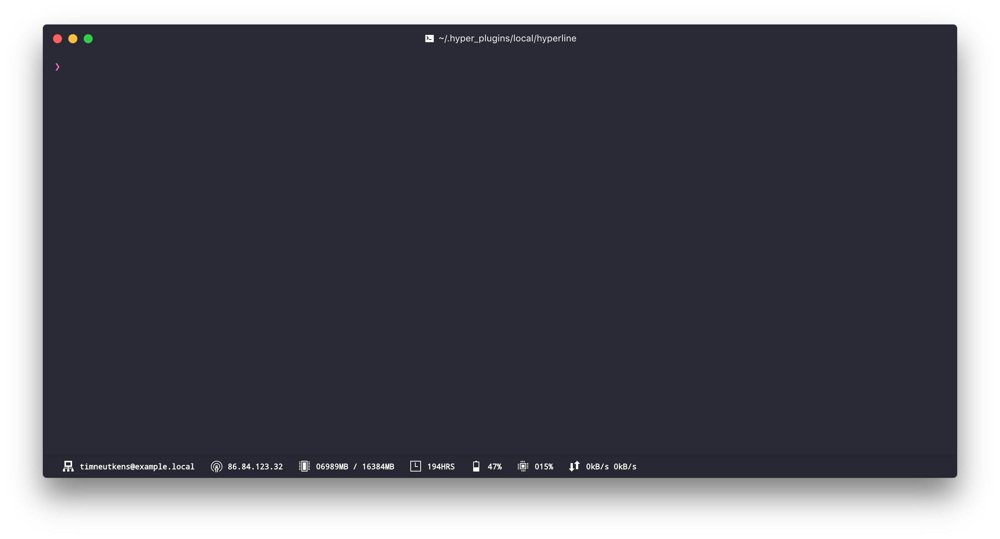

HyperLine
=========

**HyperLine is a status line plugin for [Hyper.app](https://hyper.is/)**. It shows you useful system information such as free memory, uptime and CPU usage.



## Install

* **NOTE:** HyperLine is not currently supported when using Microsoft Windows. See [this issue](https://github.com/Hyperline/hyperline/issues/57) for additional information.

To install, edit `~/.hyper.js` and add `"hyperline"` to `plugins`:

```
plugins: [
  "hyperline",
],
```

## Styling the line

We implemented the same mechanism for styling/creating css classes that Hyper uses.
This will allow you to create custom HyperLine themes the same way you would create a Hyper css theme.

## Configuring plugins
Add the names of plugins in the order in which you would like them to be displayed to your `~/.hyper.js`:

```
config: {                                                                      
  hyperline: {                                                                 
    plugins: [                                                                 
      "ip",                                                                    
      "cpu",                                                                   
      "spotify"                                                                
    ]                                                                          
  },
}
```
You can see a list of all available plugins in [`src/lib/plugins/index.js`](https://github.com/Hyperline/hyperline/blob/master/src/lib/plugins/index.js)

## Contributing

Feel free to contribute to HyperLine by [requesting a feature](https://github.com/hyperline/hyperline/issues/new), [submitting a bug](https://github.com/hyperline/hyperline/issues/new) or contributing code.

To set up the project for development:

1. Clone this repository into `~/.hyper_plugins/local/`
2. Run `npm install` within the project directory
3. Run `npm run build` to build the plugin **OR** `npm run dev` to build the plugin and watch for file changes.
4. Add the name of the directory to `localPlugins` in `~/.hyper.js`.
5. Reload terminal window

## Authors

- Nick Tikhonov [@nicktikhonov](https://github.com/nicktikhonov)
- Tim Neutkens [@timneutkens](https://github.com/timneutkens)
- Stefan Ivic [@stefanivic](https://github.com/stefanivic)
- Henrik Dahlheim [@henrikdahl](https://github.com/henrikdahl)

## Contributors

This project exists thanks to all the people who contribute.
<a href="graphs/contributors"></a>
